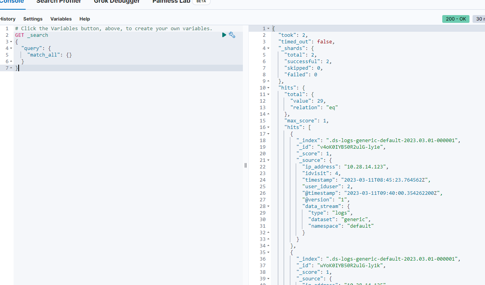
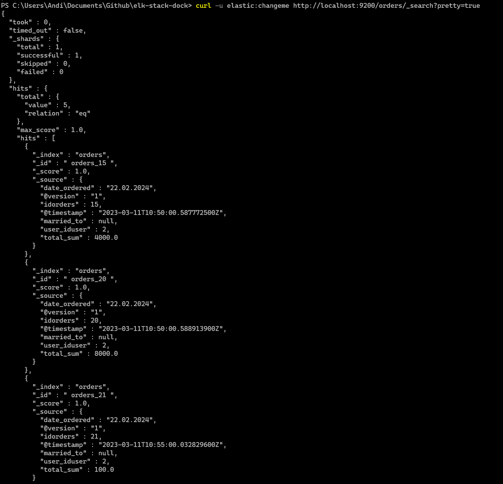
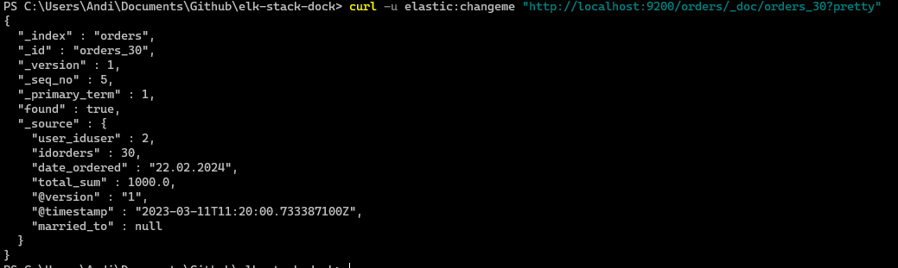
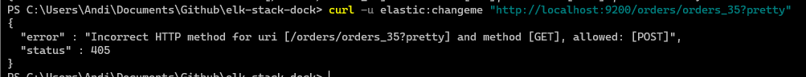
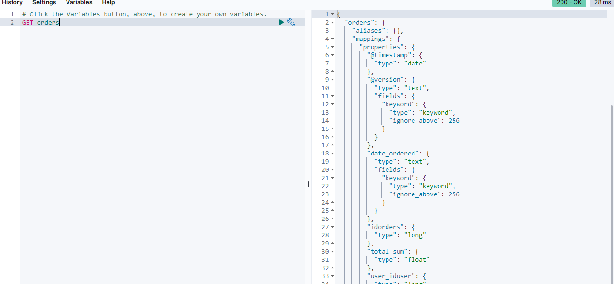
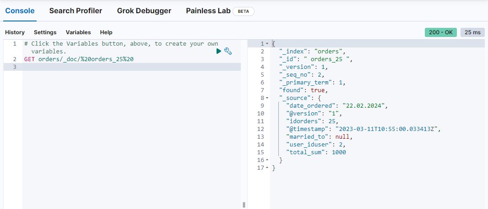

# Exercise 1

## Step 1: See a simple LogStash-Pipeline in Action

1. ```shell
   docker compose -f docker-compose.yml up -d
   ```
2. ```shell
   docker exec -it elk-stack-dock-logstash-1 /bin/bash
   ```
3. If you start a shell with Docker Desktop enter `bash` to use a more comfortable shell.
4. Find out where logstash is installed

    `which logstash`

    /usr/share/logstash/bin/logstash

5. `cd` to bin directory of logstash

    `cd /usr/share/logstash/`

6. Test a simple pipeline with input from and output to commandline.

    `bin/logstash -e 'input { stdin { } } output { stdout {} }'`

7. When using a docker container with an running Instance of logstash you have to use another `data` directory.
8. You have to start the second logstash process with the flag `--path.data data2`

    `bin/logstash -e 'input { stdin { } } output { stdout {} }' --path.data data2`

9. Wait until pipeline is running
   
   `[INFO ] 2022-02-14 07:56:05.167 [Agent thread] agent - Pipelines running {:count=>1, :running_pipelines=>[:main], :non_running_pipelines=>[]}`
   Then type `hello world`

    ```
    hello world
    {
        "@version" => "1",
        "message" => "hello world",
        "@timestamp" => 2023-03-08T21:06:24.571432800Z,
            "event" => {
            "original" => "hello world"
        },
            "host" => {
            "hostname" => "93ad5db3343f"
        }
    }
    ```

10. Stop the pipeline with `STRG-D`
11. List logstash plugins with its version

    `bin/logstash-plugin list --verbose`

12. See if jdbc-integration-plugin is installed

    `bin/logstash-plugin list --verbose | grep 'jdbc'`

    ```shell
    logstash-integration-jdbc (5.4.1)
    ├── logstash-input-jdbc
    ├── logstash-filter-jdbc_streaming
    └── logstash-filter-jdbc_static
    ```

13. Test the logstash configuration with
    ```shell
    /usr/share/logstash/bin/logstash --path.settings /usr/share/logstash/config -t
    ```

    Configuration OK

## Step 2: Working with LogStach jdbc and PostgreSQL

Work with logstash as shown in [Step 1](https://github.com/Digital-Media/big_data/blob/main/elk-stack/EXERCISE.md#step-1-see-a-simple-logstash-pipeline-in-action)


The next steps are useful for testing a jdbc-connection to a Postgres container
- replace ip with ip or name of your host
- host.docker.internal:postgresport if you use a docker container with a separate network
- use postgres connector instead of mariadb in the following example
```shell
bin/logstash --path.data data2 -e 'input {
      jdbc {
      jdbc_connection_string => "jdbc:postgresql://10.3.105.88:5432/onlineshop"
      jdbc_user => "postgres"
      jdbc_password => "geheim"
      jdbc_driver_class => "org.postgresql.Driver"
      statement => "SELECT * FROM visit"
      }
      } output { stdout {} }'
```
- Open a commandline
- See this [medium blog](https://medium.com/@emreceylan/how-to-sync-postgresql-data-to-elasticsearch-572af15845ad) for how to setup a pipeline with jdbc.


`curl https://jdbc.postgresql.org/download/postgresql-42.5.4.jar -o /usr/share/logstash/logstash-core/lib/jars/postgresql-jdbc.jar`


1. Create a table in postgres. For Example: orders, visits, order_items

```
psql -U postgres

CREATE DATABASE onlineshop;
\connect onlineshop
```

2. See [Examples](https://github.com/Digital-Media/big_data/blob/main/elk-stack/examples.sql).
3. create a configuration file to get data from postgres public.orders|visits|order_items in /usr/share/logstash/pipeline/logstash.conf
4. See [jdbc-input Doku](https://www.elastic.co/guide/en/logstash/current/plugins-inputs-jdbc.html)
5. Add tracking for PK column with :sql_last_value
6. You have to add a line for scheduling to make logstasth run without interruption: `schedule => "*/5 * * * *"`
   - This file is mapped to `<path-to-your-docker>/elk-stack-dock/logstash/pipeline/logstash.conf`
   - optional: configure a pipeline in `/usr/share/logstash/config/pipelines.yml` (a default is there). This file is not mapped.

Complete file:

```
input {
	jdbc {
        jdbc_connection_string => "jdbc:postgresql://10.3.105.88:5432/onlineshop"
        jdbc_user => "postgres"
        jdbc_password => "geheim"
        jdbc_driver_class => "org.postgresql.Driver"
        statement => "SELECT * FROM orders WHERE idorders > :sql_last_value"
        use_column_value => true
        tracking_column => "idorders"
        schedule => "*/5 * * * *"
      }
}

output {
	elasticsearch {
		hosts => "elasticsearch:9200"
		user => "logstash_internal"
		password => "${LOGSTASH_INTERNAL_PASSWORD}"
		index => "orders"
		document_id => " orders_%{idorders}"
		doc_as_upsert => true
	}
}
```

Execute pipeline with `bin/logstash -f pipeline/logstash.conf --path.data data2`

7. Go to Kibana -> Management -> Dev Tools and query logstash index, to see the data rows stored in ES by the pipeline built.



8. Compare with MongoDB Pipeline 
- See https://www.mongodb.com/developer/products/mongodb/mongoimport-guide/ to get a glue how MongoDB supports you in this case.
- See for a video-description: https://www.mongodb.com/developer/videos/import-data-into-mongodb-3-ways---bonus--export-data-from-postgres/
- MongoDB Compass can be installed locally, but Docker project was last updated in 2021.
9. Write a short summary, what is different to ELK and give a statement, what you think is easier to automate.

Both are tools for managing and analyzing data, but they have different approaches.

THe elk stack is designed for real-time analysis of log data.
MongoDB pipeline is a tool for manipulating and processing data in MongoDB, which is a NoSQL document based database. It is designed for more general data processing.
For complex data MongoDB would be easier because it provides a wide range of functions and operations with the Aggregation framework or MapReduce.

## Step 3: Adding a Metricbeat pipeline and build dashboards in Kibana

- See [Metricbeat README](https://github.com/Digital-Media/elk-stack-dock/tree/main/extensions/metricbeat#readme) for this.
- First only start the ELK-Stack. See logs of Kibana, to see if all services are already running.
- In a browser connect to `http://localhost:5601`. username/pwd: elastic/changeme
- Then use the command to start metricbeat container
1. activate requested passwords for metricbeat in `<path-to-your-docker>/elk-stack-dock/.env`.
2. rerun setup container
3. restart metricbeat
4. Test, if data are retrieved by elasticsearch
   - `curl -u elastic:changeme http://localhost:9200/_search`
   - `curl -u elastic:changeme http://localhost:9200/logstash/_search`
   - `curl -u elastic:changeme http://localhost:9200/logstash/_search?pretty=true`




    See [Query DSL Doku](https://www.elastic.co/guide/en/elasticsearch/reference/8.6/query-dsl.html) for the next steps.
5. either find the curl command to query for a specific entry in a table with a match

`curl -u elastic:changeme "http://localhost:9200/orders/_doc/orders_30?pretty"`



6. and one, that doesn't match any database entry



7. Connect to Kibana in Browser
8. Goto Burger Menu -> Management -> Dev Tools
10. Query for all entries in logstash index.



11. Query for a specific entry, like you did with curl

`GET orders/_doc/orders_25`



12. Sort the entries in asc and desc order

Query all and sort with total_sum

```
GET orders/_search
{
  "sort" : [
    { "total_sum": {"order": "desc"}}
  ],
  "query": {
    "match_all": {}
  }
}
```