# Exercises with a document database

We use MongoDB as example for a document store to demonstrate map reduce jobs for aggregating data.

## Get a MongoDB installation

See [INSTALL.md](https://github.com/Digital-Media/big_data/blob/main/document/INSTALL.md) for Details and Troubleshooting

## Exercises with MongoDB

Rewrite the example from [MongoDB Website]( https://docs.mongodb.com/manual/tutorial/map-reduce-examples/).
Work with the mongo shell within the provided image or get an Account on MongoDB Atlas.

### Step 1: Adding Data

1. Start `mongo`

`docker exec -it mongodb /bin/bash -c "mongosh"`

2. Show available databases

`show dbs`

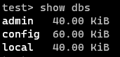

3. Create database onlineshop

`use onlineshop`

4. Insert the following data sets

```
db.orders.insertMany([
      { _id: 1, user_id: 1, date_ordered: new Date("2020-03-01"), total_sum: 25, items: [ { sku: "oranges", qty: 5, price: 2.5 }, { sku: "apples", qty: 5, price: 2.5 } ], status: "A" },
      { _id: 2, user_id: 1, date_ordered: new Date("2020-03-08"), total_sum: 70, items: [ { sku: "oranges", qty: 8, price: 2.5 }, { sku: "chocolates", qty: 5, price: 10 } ], status: "A" },
      { _id: 3, user_id: 2, date_ordered: new Date("2020-03-08"), total_sum: 50, items: [ { sku: "oranges", qty: 10, price: 2.5 }, { sku: "pears", qty: 10, price: 2.5 } ], status: "A" },
      { _id: 4, user_id: 2, date_ordered: new Date("2020-03-18"), total_sum: 25, items: [ { sku: "oranges", qty: 10, price: 2.5 } ], status: "A" },
      { _id: 5, user_id: 2, date_ordered: new Date("2020-03-19"), total_sum: 50, items: [ { sku: "chocolates", qty: 5, price: 10 } ], status: "A"},
      { _id: 6, user_id: 3, date_ordered: new Date("2020-03-19"), total_sum: 35, items: [ { sku: "carrots", qty: 10, price: 1.0 }, { sku: "apples", qty: 10, price: 2.5 } ], status: "A" },
      { _id: 7, user_id: 3, date_ordered: new Date("2020-03-20"), total_sum: 25, items: [ { sku: "oranges", qty: 10, price: 2.5 } ], status: "A" },
      { _id: 8, user_id: 4, date_ordered: new Date("2020-03-20"), total_sum: 75, items: [ { sku: "chocolates", qty: 5, price: 10 }, { sku: "apples", qty: 10, price: 2.5 } ], status: "A" },
      { _id: 9, user_id: 4, date_ordered: new Date("2020-03-20"), total_sum: 55, items: [ { sku: "carrots", qty: 5, price: 1.0 }, { sku: "apples", qty: 10, price: 2.5 }, { sku: "oranges", qty: 10, price: 2.5 } ], status: "A" },
      { _id: 10, user_id: 4, date_ordered: new Date("2020-03-23"), total_sum: 25, items: [ { sku: "oranges", qty: 10, price: 2.5 } ], status: "A" }
      ]);
```

5. Find all rows of collection orders.

`db.orders.find()`

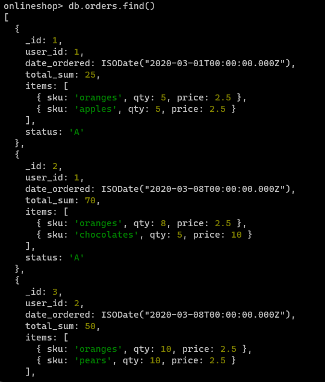

### Step 2: Working with map_reduce 

Map-Reduce is no longer supported for versions above 5.0 or in MongoDB Atlas Cloud.

Read the Doku to understand a principle introduced by Google for GFS and the open source hadoop Filesystem, that is based on the idea of GFS.

See [Map Reduce Documention](https://docs.mongodb.com/manual/core/map-reduce/) to see, how that works.

```
When using sharded collection as the input for a map-reduce operation, mongos will automatically dispatch the map-reduce job to each shard in parallel.
It will also automatically wait for all jobs on all shards to finish.
```

### Step 3: Use MongoDB Atlas Aggregation to build a pipeline

Create an Atlas Account for free [here](https://www.mongodb.com/cloud/atlas/register), if you'd like to work in the cloud.

If you use the shell see [Doku](https://docs.mongodb.com/manual/reference/mongo-shell/)

1. Write a query using aggregation to build the sum of total_sum.

```json
[
  {
    $group:
      {
        _id: null,
        total_sum: {
          $sum: "$total_sum",
        },
      },
  },
]
```

2. Write a query using aggregation to build the sum of prices*qty for every item of a user.


```json
[
  {
    $unwind: "$items",
  },
  {
    $project: {
      _id: 1,
      total_price: {
        $multiply: ["$items.price", "$items.qty"],
      },
    },
  },
  {
    $group: {
      _id: "$_id",
      total_sum: {
        $sum: "$total_price",
      },
    },
  },
  {
    $project: {
      _id: 0,
      id: "$_id",
      total_sum: 1,
    },
  },
  {
    $sort:
      {
        id: 1,
      },
  },
]
```

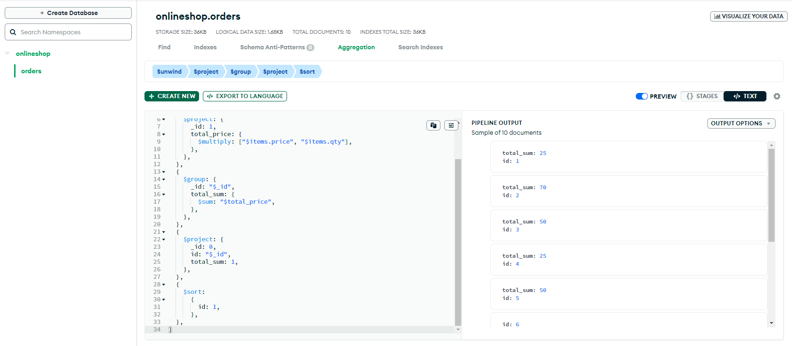

3. See  [Map Reduce Doku](https://docs.mongodb.com/manual/reference/method/db.collection.mapReduce/#mongodb-method-db.collection.mapReduce) for a example aggregation. Scroll down for examples.
4. For more details see [Aggregation Quick Reference](https://docs.mongodb.com/manual/meta/aggregation-quick-reference/)
5. Or use the Aggregation Tab in MongoDB Atlas

### Step 4: Deleting rows and the Database

1. Delete all rows in the collection orders

`db.orders.remove({})`

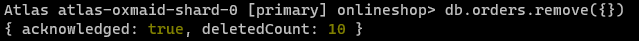

2. Drop the database onlineshop

`db.dropDatabase()`

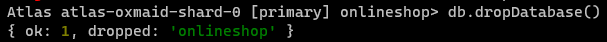
      
### Step 5 Exercise for additional points

Build your own example to demonstrate a complexer aggregation with a stage `geonear`, `search` (based on Lucene, that is only available on Atlas Cloud)

Add a few location entries for geonear aggregation:
```
db.places.insertMany( [
   {
      name: "Central Park",
      location: { type: "Point", coordinates: [ -73.97, 40.77 ] },
      category: "Parks"
   },
   {
      name: "Sara D. Roosevelt Park",
      location: { type: "Point", coordinates: [ -73.9928, 40.7193 ] },
      category: "Parks"
   },
   {
      name: "Polo Grounds",
      location: { type: "Point", coordinates: [ -73.9375, 40.8303 ] },
      category: "Stadiums"
   }
] )
```

Add a 2dshpere index on the location field:
`db.places.createIndex( { location: "2dsphere" } )`

Create an aggregation which returns all parks within 10km of the given coordinates.
There is also a distance field added which returns the distance to the target.

```json
[
  {
    $geoNear:
      /**
       * near: The point to search near.
       * distanceField: The calculated distance.
       * maxDistance: The maximum distance, in meters, documents can be before being excluded from results.
       * query: Limits results that match the query
       * includeLocs: Optional. Labels and includes the point used to match the document.
       * num: Optional. The maximum number of documents to return.
       * spherical: Defaults to false. Specifies whether to use spherical geometry.
       */
      {
        near: {
          type: "Point",
          coordinates: [-73.99279, 40.719296],
        },
        distanceField: "dist.calculated",
        maxDistance: 10000,
        query: {
          category: "Parks",
        },
        includeLocs: "dist.location",
        spherical: true,
      },
  },
]
```

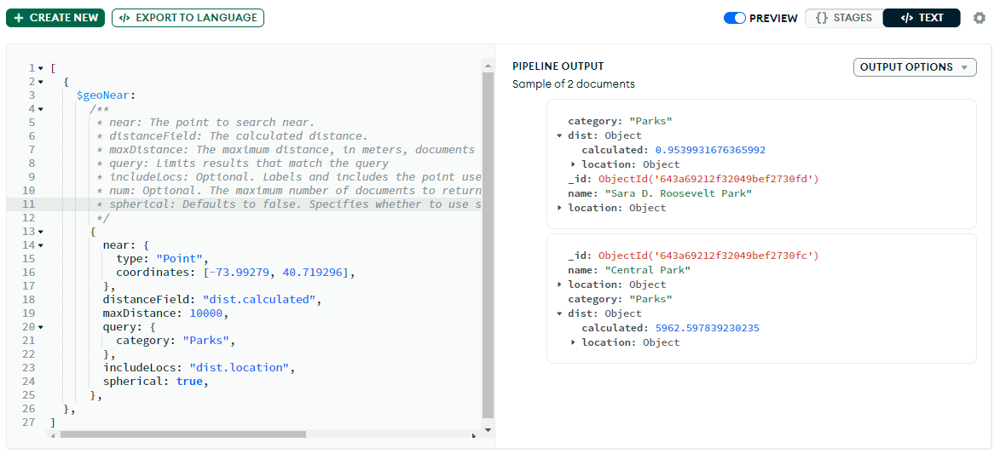

# Work with MongoDB Atlas Data API

Create an Atlas Account for free [here](https://www.mongodb.com/cloud/atlas/register)
Create an API Key.

Create a database onlineshop, if not already done before.
Create a collection product with pname, price and status ('published', 'revision')
Create a collection user with frist_name, last_name, email, password, date_registered and a subcollection for phone numbers (mobile, private, fax)

Add some data manually.

Products:
```shell
db.products.insert([
    {_id: 0, pname: "test1", price: 100, status: { published: false, revision: 1}},
    {_id: 1, pname: "test2", price: 150, status: { published: false, revision: 1}},
    {_id: 2, pname: "test3", price: 220.0, status: { published: false, revision: 1}},
    {_id: 3, pname: "test4", price: 330.32, status: { published: true, revision: 3}},
    {_id: 4, pname: "test5", price: 40, status: { published: true, revision: 1}},
    {_id: 5, pname: "test6", price: 19.99, status: { published: true, revision: 1}},
    {_id: 6, pname: "test7", price: 1.99, status: { published: true, revision: 1}}
])
```

Users:
```shell
db.users.insert([
    {_id: 0, first_name: "fname1", last_name: "lname1", email: "fname1.@lname1.com", password: "franz", date_registered: "2023-04-15", phone_numbers: [ { _id: 0, phone_number: "06998805551" } ] },
    {_id: 1, first_name: "fname2", last_name: "lname2", email: "fname2.@lname2.com", password: "frenz", date_registered: "2023-04-15", phone_numbers: [ { _id: 1, phone_number: "06998805551" } ] },
    {_id: 2, first_name: "fname3", last_name: "lname3", email: "fname3.@lname3.com", password: "frunz", date_registered: "2023-04-15", phone_numbers: [ { _id: 2, phone_number: "06998805551" } ] }
])
```

## Test and work with API:
- [Data API Basics](https://www.mongodb.com/docs/atlas/api/data-api/)
- [Advanced Atlas Client](https://www.mongodb.com/developer/products/atlas/advanced-data-api-with-atlas-cli/)
- [Standard Data API Resources](https://www.mongodb.com/docs/atlas/api/data-api-resources/#std-label-data-api-resources)

## In Linux bash:

Write curl query for

1. findOne

```shell
curl --location --request POST 'https://eu-central-1.aws.data.mongodb-api.com/app/data-hloeg/endpoint/data/v1/action/findOne' \
--header 'Content-Type: application/json' \
--header 'Access-Control-Request-Headers: *' \
--header 'api-key: G76S5alSDokn3f8s2S8uCdCL4Uezfs67NnvdgN35Hw42M8x2ej75pyGU9RbJNKg5' \
--data-raw '{
    "collection":"products",
    "database":"onlineshop",
    "dataSource":"Cluster0",
    "filter": { "_id": 1 }
}'
```

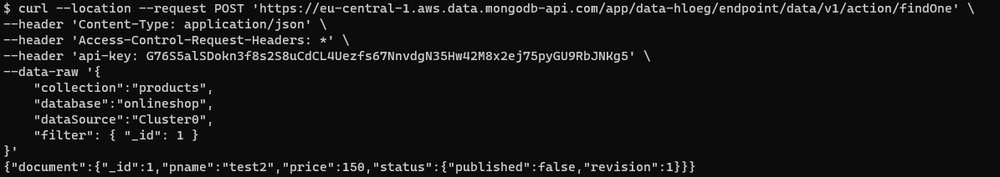

2. findMany

```shell
curl --location --request POST 'https://eu-central-1.aws.data.mongodb-api.com/app/data-hloeg/endpoint/data/v1/action/find' \
--header 'Content-Type: application/json' \
--header 'Access-Control-Request-Headers: *' \
--header 'api-key: ****' \
--data-raw '{
    "collection":"products",
    "database":"onlineshop",
    "dataSource":"Cluster0"
}'
```

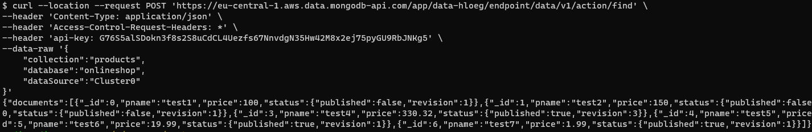

3. insertOne

```shell
curl --request POST \
  'https://eu-central-1.aws.data.mongodb-api.com/app/data-hloeg/endpoint/data/v1/action/insertOne' \
  --header 'Content-Type: application/json' \
  --header 'Access-Control-Request-Headers: *' \
  --header 'api-key: ****' \
  --data-raw '{
    "collection":"products",
    "database":"onlineshop",
    "dataSource":"Cluster0",
    "document": {
        "_id": 15,
        "pname": "inserted",
        "price": 100,
        "status": { 
            "published": false,
            "revision": 1
        }
    }
  }'
```

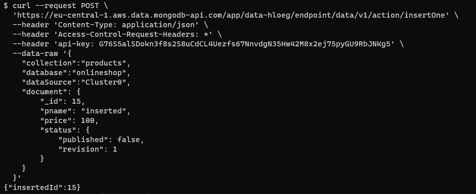

4. updateOne

```shell
curl --request POST \
  'https://eu-central-1.aws.data.mongodb-api.com/app/data-hloeg/endpoint/data/v1/action/updateOne' \
  --header 'Content-Type: application/json' \
  --header 'Access-Control-Request-Headers: *' \
  --header 'api-key: ****' \
  --data-raw '{
    "collection":"products",
    "database":"onlineshop",
    "dataSource":"Cluster0",
    "filter": { "_id": 15 },
    "update": {
          "$set": {
              "status": { 
                "published": true,
                "revision": 2
              }
          }
      }
  }'
```

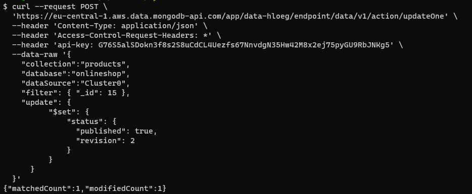

5. deleteOne

```shell
curl --location --request POST 'https://eu-central-1.aws.data.mongodb-api.com/app/data-hloeg/endpoint/data/v1/action/deleteOne' \
--header 'Content-Type: application/json' \
--header 'Access-Control-Request-Headers: *' \
--header 'api-key: ****' \
--data-raw '{
    "collection":"products",
    "database":"onlineshop",
    "dataSource":"Cluster0",
    "filter": {"_id": 15}
}'
```

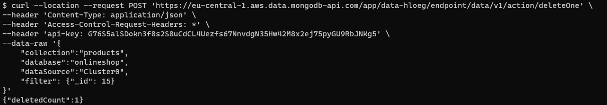


