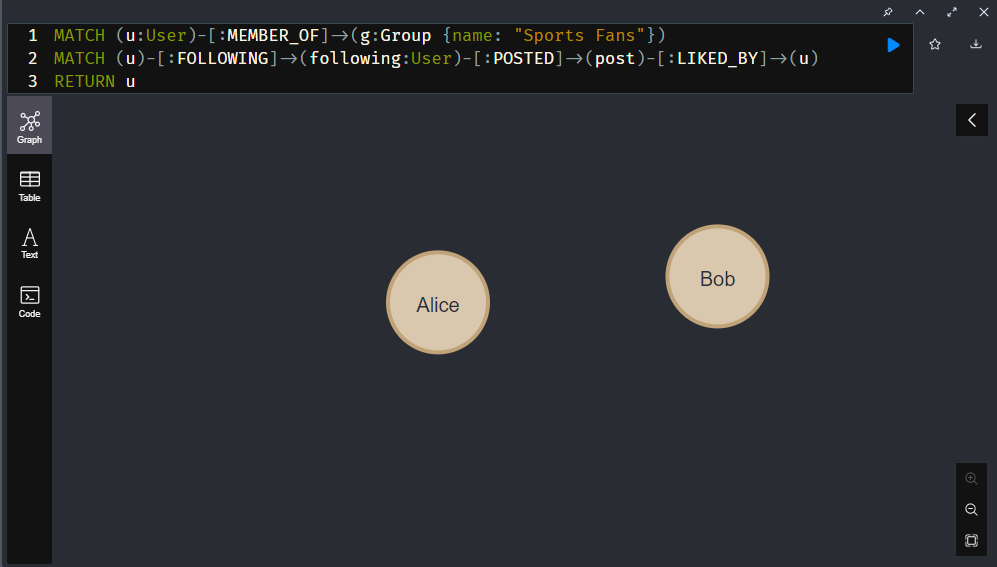

# Exercises with a graph database

We use Neo4j to write CQL queries and PostgreSQL for Graph-Queries based on an ER-model queried with SQL.
Apache Spark will set up CQL on top of it's SQL query interface. So it's useful to understand both ways to work with graphs.
Neo4J supports them doing this.

## Get an Neo4J and PostgreSQL installation

See [INSTALL.md](https://github.com/Digital-Media/big_data/blob/main/graph/INSTALL.md) for Details and Troubleshooting

I created a docker-compose file for Neo4J.

```yml
version: '3.8'

services:
  testneo4j:
    image: neo4j:latest
    container_name: testneo4j
    ports:
      - "7474:7474"
      - "7687:7687"
    environment:
      NEO4J_AUTH: none
      NEO4J_ACCEPT_LICENSE_AGREEMENT: "yes"
    volumes:
      - /neo4j/data:/data
      - /neo4j/import:/var/lib/neo4j/import
      - /neo4j/plugins:/plugins
      - /neo4j/logs:/logs
```

## Exercises for graph queries

Graphs can also be built in a relational data model. 
The SQL standard supports graph queries through the RECURSIVE WITH clause.

### Step 1

Transform the recursive with examples of [this repo](https://github.com/Digital-Media/big_data/blob/main/graph/recursive_cte.sql) from MySQL to PostgreSQL. 

```sql
DROP SCHEMA IF EXISTS graph_demos CASCADE;
CREATE SCHEMA IF NOT EXISTS graph_demos;
-- SET search_path = graph_demos;

-- simple recursion example from mariadb documentation

CREATE TABLE IF NOT EXISTS folks (
id BIGINT NOT NULL,
name VARCHAR(100) NOT NULL,
father BIGINT NULL,
mother BIGINT NULL,
PRIMARY KEY (id),
CONSTRAINT father_fk FOREIGN KEY (father) REFERENCES folks(id),
CONSTRAINT mother_fk FOREIGN KEY (mother) REFERENCES folks(id)
);

INSERT INTO folks (id, name, father, mother) VALUES
(100, 'Alex', 20, 30),
(20, 'Dad', 10, null),
(30, 'Mom', null, null),
(10, 'Grandpa Bill', null, null),
(98, 'Sister Amy', 20, 30);

-- demonstrates, that result set is ordered with id asc
SELECT * FROM folks;

-- demonstrate cte
WITH RECURSIVE ancestors AS (
SELECT * FROM folks
WHERE name = 'Alex'
UNION
SELECT f.*
FROM folks AS f , ancestors AS a
WHERE f.id = a.father OR f.id = a.mother
)
SELECT * FROM ancestors;

-- complex graph example

CREATE TABLE vertices (
NT NOT NULL,
alias VARCHAR (255),
label VARCHAR (255),
name VARCHAR (255),
type VARCHAR (255),
properties json,
PRIMARY KEY (
CREATE TABLE IF NOT EXISTS vertices (
NT NOT NULL,
alias VARCHAR(255),
label VARCHAR(255),
name VARCHAR(255),
type VARCHAR(255),
properties JSON,
PRIMARY KEY (
INSERT INTO vertices (as, label, name, type) VALUES
(1, 'NAmerica', 'Location', 'North America', 'continent'),
(2, 'Europe', 'Location', 'Europe', 'continent'),
(3, 'USA', 'Location', 'United States', 'country'),
(4, 'UK', 'Location', 'United Kingdom', 'country'),
(5, 'England', 'Location', 'England', 'country'),
(6, 'Austria', 'Location', 'Österreich', 'country'),
(7, 'Idaho', 'Location', 'Idaho', 'state'),
(8, 'London', 'Location', 'London', 'city'),
(9, 'UpperAustria', 'Location', 'Oberösterreich', 'Bundesland'),
(10, 'Waldviertel', 'Location', 'Waldviertel', 'Viertel'),
(11, 'Grein', 'Location', 'Grein', 'city'),
(12, 'Andrea', 'Person', 'Andrea', 'person'),
(13, 'Bert', 'Person', 'Bert', 'person'),
(14, 'Christian', 'Person', 'Christian', 'person');

-- create edges table
CREATE TABLE IF NOT EXISTS edges (
edge_id BIGINT NOT NULL,
tail_vertex BIGINT NOT NULL REFERENCES vertices (ad_vertex BIGINT NOT NULL REFERENCES vertices (bel VARCHAR(255),
properties JSON,
PRIMARY KEY (edge_id)
);


-- insert data into edges table
INSERT INTO edges (edge_id, tail_vertex, head_vertex, label) VALUES
(1, 3, 1, 'within'),
(2, 4, 2, 'within'),
(3, 5, 4, 'within'),
(4, 6, 2, 'within'),
(5, 7, 3, 'within'),
(6, 8, 5, 'within'),
(7, 9, 6, 'within'),
(8, 10, 9, 'within'),
(9, 11, 10, 'within'),
(10, 12, 7, 'born_in'),
(11, 12, 8, 'lives_in'),
(12, 13, 11, 'born_in'),
(13, 13, 8, 'lives_in'),
(14, 14, 8, 'born_in'),
(15, 12, 13, 'married'),
(16, 13, 12, 'married');

WITH RECURSIVE
in_usa((
    SELECT  vertices WHERE name = 'United States'
  UNION
    SELECT edges.tail_vertex
    FROM edges JOIN in_usa
    ON edges.head_vertex = in_usa.WHERE edges.label = 'within'
),
in_europe((
    SELECT  vertices WHERE name = 'Europe'
  UNION
    SELECT edges.tail_vertex
    FROM edges JOIN in_europe
    ON edges.head_vertex = in_europe.WHERE edges.label = 'within'
),
born_in_usa((
    SELECT edges.tail_vertex
    FROM edges JOIN in_usa
    ON edges.head_vertex = in_usa.WHERE edges.label = 'born_in'
),
lives_in_europe((
    SELECT edges.tail_vertex
    FROM edges
    JOIN in_europe ON edges.head_vertex = in_europe.WHERE edges.label = 'lives_in'
)
SELECT vertices.name
FROM vertices
JOIN born_in_usa ON vertices.rn_in_usa. lives_in_europe ON vertices.ves_in_europe.
```

### Step 2

Use the [Cypher Reference](https://neo4j.com/docs/cypher-refcard/current/) for examples and detailed syntax.

#### Transform the data model from PostreSQL/MySQL to Neo4J

1.	Write CREATE statements for the vertices and edges analogous to the insert statements in Postgres/MySQL for the simple example

Rename to persons instead of folks.
```sql
CREATE
(p_alex:Person {name: 'Alex'}),
(p_dad:Person {name: 'Dad'}),
(p_mom:Person {name: 'Mom'}),
(p_grandpa_bill:Person {name: 'Grandpa Bill'}),
(p_sister_amy:Person {name: 'Sister Amy'}),

(p_dad)-[:father_of]->(p_alex),
(p_mom)-[:mother_of]->(p_alex),
(p_dad)-[:father_of]->(p_sister_amy),
(p_mom)-[:father_of]->(p_sister_amy),
(p_grandpa_bill)-[:mother_of]->(p_dad)
```

```sql
CREATE 
(n_america:Location {alias: 'NAmerica', name: 'North America', type: 'continent'}),
(europe:Location {alias: 'Europe', name: 'Europe', type: 'continent'}),
(usa:Location {alias: 'USA', name: 'United States', type: 'country'}),
(uk:Location {alias: 'UK', name: 'United Kingdom', type: 'country'}),
(england:Location {alias: 'England', name: 'England', type: 'country'}),
(austria:Location {alias: 'Austria', name: 'Österreich', type: 'country'}),
(idaho:Location {alias: 'Idaho', name: 'Idaho', type: 'state'}),
(london:Location {alias: 'London', name: 'London', type: 'city'}),
(upper_austria:Location {alias: 'UpperAustria', name: 'Oberösterreich', type: 'Bundesland'}),
(waldviertel:Location {alias: 'Waldviertel', name: 'Waldviertel', type: 'Viertel'}),
(grein:Location {alias: 'Grein', name: 'Grein', type: 'city'}),
(andrea:Person {alias: 'Andrea', name: 'Andrea'}),
(bert:Person {alias: 'Bert', name: 'Bert'}),
(christian:Person {alias: 'Christian', name: 'Christian'}),

(usa)-[:within]->(n_america),
(uk)-[:within]->(europe),
(england)-[:within]->(uk),
(austria)-[:within]->(europe),
(idaho)-[:within]->(usa),
(london)-[:within]->(england),
(upper_austria)-[:within]->(austria),
(waldviertel)-[:within]->(upper_austria),
(grein)-[:within]->(waldviertel),
(andrea)-[:born_in]->(idaho),
(andrea)-[:lives_in]->(london),
(bert)-[:born_in]->(grein),
(bert)-[:lives_in]->(london),
(christian)-[:born_in]->(london),
(andrea)-[:married]->(bert),
(bert)-[:married]->(andrea)
```

2.	Write the statement to show the whole graph.

This will show the whole graph and the edges.
```sql
MATCH (n)
OPTIONAL MATCH (n)-[r]->(m)
RETURN n, collect(r), collect(m)
```

This will show the whole graph without the edges.
```sql	
MATCH (n)
RETURN n
```

3.	Read (return) all :Person nodes

```sql
MATCH (n:Person) RETURN n
```

4.	Return all names of :Person nodes

```sql
MATCH (n:Person) RETURN n.name
```

5.	CREATE a new :Person with name “Grandma Mary”

```sql
CREATE(:Person {
  alias: 'Grandma Mary',
  name: 'Grandma Mary',
})
```

6.	CREATE edges to make “Grandma Mary” Mother of “Mom” and “Dad”

```sql
MATCH (a:Person {name: 'Grandma Mary'}), (b:Person {name: 'Dad'})
CREATE (a)-[:mother_of]->(b);

MATCH (a:Person {name: 'Grandma Mary'}), (b:Person {name: 'Mom'})
CREATE (a)-[:mother_of]->(b);
```

7.	Return the ancestors of Alex as nodes. Then return the names of them in a second statement.

```sql
MATCH (:Person {name: 'Alex'})-[r]-(b)
RETURN b
```

```sql
MATCH (:Person {name: 'Alex'})-[r]-(b)
RETURN b.name
```

8.	Add “Grandpa Bim” and make him father of “Mom” and “Dad”.

Is already added as father of dad, but not of mum.

```sql
MATCH (a:Person {name: 'Grandpa Bill'}), (b:Person {name: 'Mom'})
CREATE (a)-[:father_of]->(b);
```

9.	Return his ancestor tree.

```sql
MATCH (n:Person {name: 'Grandpa Jim'}) -[r]->(m)
RETURN *
```

10.	Add edges to marry “Mom” and “Dad” as well as “Grandma Mary” and “Grandpa Jim”

```sql	
MATCH (a:Person), (b:Person)
WHERE a.name = 'Mom' AND b.name = 'Dad'
CREATE (a)-[r:married]->(b)
RETURN r;

MATCH (a:Person), (b:Person)
WHERE a.name = 'Dad' AND b.name = 'Mom'
CREATE (a)-[r:married]->(b)
RETURN r;

MATCH (a:Person), (b:Person)
WHERE a.name = 'Gradma Mary' AND b.name = 'Grandpa Bill'
CREATE (a)-[r:married]->(b)
RETURN r;

MATCH (a:Person), (b:Person)
WHERE a.name = 'Gradma Mary' AND b.name = 'Gradma Mary'
CREATE (a)-[r:married]->(b)
RETURN r;
```

11.	Return the whole ancestor tree, without showing the edges for being married. (You have to uncheck “connect result nodes” in settings of the sandbox.

```sql
MATCH (p:Person)-[r:father_of|mother_of]->(rp:Person)
RETURN p, r, rp
```

#### Add properties to nodes and edges
1.	Add a property to all edges, that tell who is married to whom. It should store the year, when people got married.

```sql
MATCH (p1:Person)-[r:married]-(p2:Person)
WHERE p1.name = 'Grandma Mary' AND p2.name = 'Grandpa Bill'
SET r.year = 1950;

MATCH (p1:Person)-[r:married]-(p2:Person)
WHERE p1.name = 'Mom' AND p2.name = 'Dad'
SET r.year = 1970;
```

2.	Add a property to all nodes that stores the year, when someone was born.

```sql
MATCH (p:Person {name: 'Grandpa Bill'})
SET p.year_of_birth = 1930;

MATCH (p:Person {name: 'Grandma Mary'})
SET p.year_of_birth = 1925;

MATCH (p:Person {name: 'Mum'})
SET p.year_of_birth = 1960;

MATCH (p:Person {name: 'Dad'})
SET p.year_of_birth = 1965;
```

3.	Use the WHERE clause to find the ancestor tree of persons born in a particular year.

```sql
MATCH (n:Person)
WHERE n.year_of_birth=1925 
RETURN n
```

4.	Find persons that have been married in a particular year.

```sql
MATCH (p1:Person)-[r:married]-(p2:Person)
WHERE r.year = 1950
RETURN p1, p2;
```

### Step 3
Add the Nodes and Edges of the complex example in the scriptum to Neo4J.

1.	Look at the [SQL example](https://github.com/Digital-Media/big_data/blob/main/graph/src/recursive_cte.sql) to add missing nodes and edges.

```text
Nodes and edges where already added above.
```

2.	Rewrite the MATCH statement in a way that makes it clear that only nodes with a label :Person are relevant and use a different variable to return the result.

```sql
MATCH
  (p:Person)-[:born_in]->()-[:within*0..]->(us:Location {name:'United States'}),
  (p:Person)-[:lives_in]->()-[:within*0..]->(eu:Location {name:'Europe'})
RETURN p
```

### Step 4: Exercise for additional points
Create own example for a complexer graph-query. 3 Edge-Types, 2 Node-Types to follow.

We have a social network graph with users and groups.
For the edges we have following, member_of and likes.

```sql
CREATE (u1:User {name: "Alice"})
CREATE (u2:User {name: "Bob"})
CREATE (u3:User {name: "Charlie"})
CREATE (g1:Group {name: "Sports Fans"})
CREATE (g2:Group {name: "Music Fans"})
CREATE (p1:Post {content: "Great game last night!"})
CREATE (p2:Post {content: "Just saw my favorite band in concert!"})
CREATE (u1)-[:MEMBER_OF]->(g1)
CREATE (u2)-[:MEMBER_OF]->(g1)
CREATE (u3)-[:MEMBER_OF]->(g2)
CREATE (u1)-[:FOLLOWING]->(u2)
CREATE (u1)-[:FOLLOWING]->(u3)
CREATE (u2)-[:FOLLOWING]->(u1)
CREATE (u2)-[:FOLLOWING]->(u3)
CREATE (u3)-[:FOLLOWING]->(u2)
CREATE (u1)-[:POSTED]->(p1)
CREATE (u2)-[:POSTED]->(p2)
CREATE (u3)-[:POSTED]->(p1)
CREATE (u3)-[:POSTED]->(p2)
CREATE (p1)-[:LIKED_BY]->(u1)
CREATE (p2)-[:LIKED_BY]->(u2)
CREATE (p3)-[:LIKED_BY]->(u3)
```

We want to find all users that are member of the group "Sports Fans" and follow a user who posted something that they have liked.

```sql
MATCH (u:User)-[:MEMBER_OF]->(g:Group {name: "Sports Fans"})
MATCH (u)-[:FOLLOWING]->(following:User)-[:POSTED]->(post)-[:LIKED_BY]->(u)
RETURN u
```



For example bob follows charlie and charlie posted something which he liked. Both are in the same group "Sports Fans".